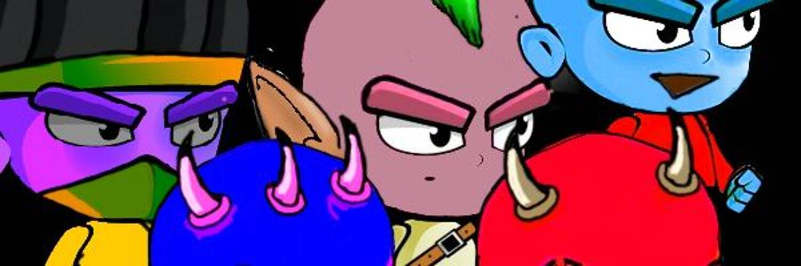

# Mini MetaHeros Guild

Mini Metaheros 是 5000 名生成英雄的集合，具有 200 多种稀有程度不同的特征。 化身的集合将是即将到来的游戏的重点，而沉浸式生态系统“The MiniMetaverse”他们很可爱。 他们很有趣。 他们完全踢屁股。持有人将首先在 MiniMetaverse 中拥有财产。 持有者还将收到武器、车辆等的空投。

Mini MetaHeros Guild NFT - 常见问题（FAQ）
▶ 什么是迷你 MetaHeros 公会？
Mini MetaHeros Guild 是一个 NFT（非同质代币）集合。存储在区块链上的数字艺术品集合。
▶ 有多少 Mini MetaHeros Guild 代币？
总共有 5,000 个 Mini MetaHeros Guild NFT。目前 27 位所有者的钱包中至少有一个 Mini MetaHeros Guild NTF。
▶ 最近卖出了多少个 Mini MetaHeros Guild？
过去 30 天内共售出 0 个 Mini MetaHeros Guild NFT。

