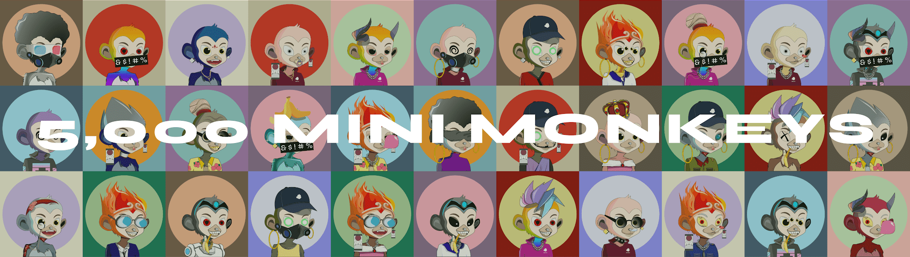

# Mini Monkey Mafia

Mini Monkey Mafia 是存在于以太坊区块链上的 5,000 个随机生成的 NFT 的集合。 黑手党成员可以参与独家活动，例如 NFT 认领、抽奖、社区赠品等。 加入黑手党，这是您不想拒绝的提议...实用程序包括：用于每日 $NANA 代币的独家“Claim-To-Earn”应用程序、每周“迷你游戏”锦标赛、用于兑换您的 $ 的奖品市场 NANA 用于加密、游戏机、商品等！ 每拥有 2 只小猴子，就可以培育出具有相似特征的小猴子！

为什么要养一只小猴子？
Baby Mini Monkey 系列不仅仅是可爱的小猴子系列......它还包括对一些很棒的实用程序的独家访问！

薄荷通行证
Mini Monkey Mafia 将进行合作，Baby Mini Monkey 持有者将能够通过独家薄荷通行证访问 NFT！

奖励
如果您持有小猴宝宝，您可以获得超棒的奖励！拥有多只小猴子？还有更多奖励！

