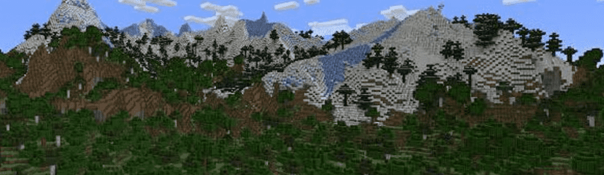

# Miniscape

这将成为您未来像素化土地的关键。 薄荷出炉后揭晓！

Miniscape NFT 在过去 7 天内售出 1 次。Miniscape 的总销售额为 10.87 美元。一份 Miniscape NFT 的平均价格为 10.9 美元。有 496 名 Miniscape 所有者，总共拥有 1,000 个代币。

Miniscape NFT - 常见问题（FAQ）
▶ 什么是迷你景观？
Miniscape 是一个 NFT（不可替代代币）集合。存储在区块链上的数字艺术品集合。
▶ 有多少 Miniscape 代币？
总共有 1,000 个 Miniscape NFT。目前，496 位车主的钱包中至少有一个 Miniscape NTF。
▶ 什么是最昂贵的 Miniscape 销售？
最昂贵的 Miniscape NFT 被 隐藏了。它于 2022-07-02（大约 2 个月前）以 10.9 美元的价格售出。
▶ 最近卖出了多少 Miniscape？
过去 30 天内售出了 1 个 Miniscape NFT。

