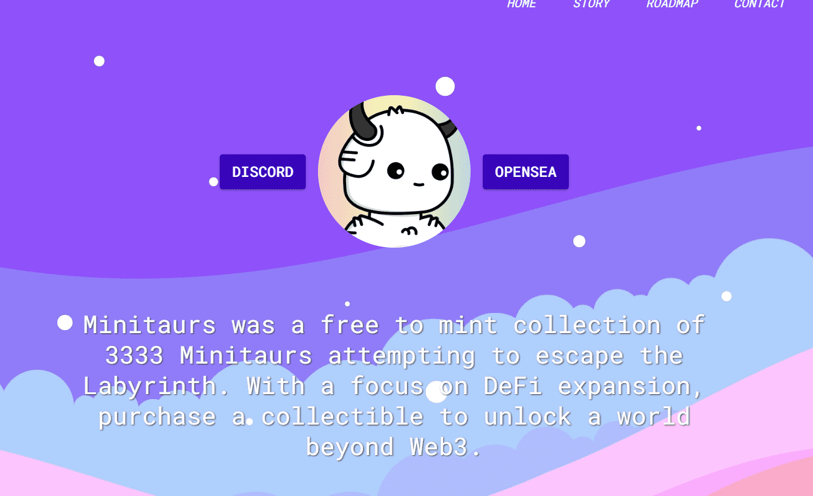

# Minitaurs Reborn

Minitaurs 是 3333 只试图逃离迷宫的 Minitaurs 的免费集合。专注于 DeFi 扩展，购买收藏品以解锁 Web3 之外的世界。Minitaur是3333个试图逃离迷宫的Minitaurs的免费收集。专注于DeFi扩展，购买收藏品，开启Web3之外的世界。

什么是 Minitaurs Reborn？

Minitaurs Reborn 是一个 NFT（不可替代代币）集合。存储在区块链上的数字艺术品集合。

有多少 Minitaurs Reborn 代币？

总共有 3,333 个 Minitaurs Reborn NFT。目前，1,652 位车主的钱包中至少有一个 Minitaurs Reborn NTF。

Minitaurs Reborn 最昂贵的销售是什么？

售出的最昂贵的 Minitaurs Reborn NFT 是 [Minitaur #308](https://www.nft-stats.com/asset/0xfa10661c28f309b88aecf14d9ab8f24764d6b10d/308)。它于 2022-06-11（3 个月前）以 11.6 美元的价格售出。

最近卖出了多少Minitaurs Reborn？

过去 30 天内售出了 2 个 Minitaurs Reborn NFT。

