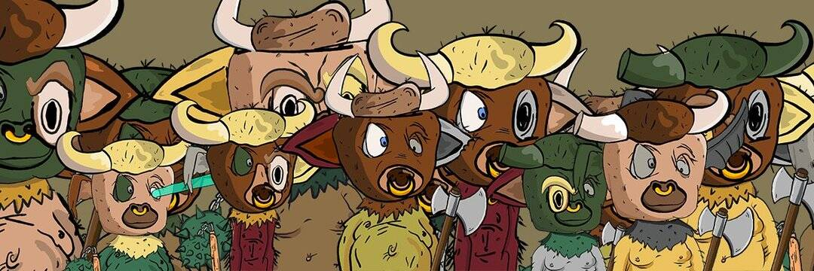

# minotaurustown

牛头怪镇 ket tam 拖。
Stealqu 发射防御者。

minotaurustown NFT - 常见问题（FAQ）
▶ 什么是牛头怪镇？
minotaurustown 是一个 NFT（非同质代币）集合。存储在区块链上的数字艺术品集合。
▶ 有多少个 Minotaurustown 代币？
总共有 3,297 个 minotaurustown NFT。目前，1,051 位车主的钱包中至少有一个 minotaurustown NTF。
▶ 什么是最昂贵的 Minotaurustown 销售？
售出的最昂贵的 minotaurustown NFT 是 minotaurustown #19。它于 2022 年 6 月 24 日（2 个月前）以 8.8 美元的价格售出。
▶ 最近卖了多少个牛头怪镇？
过去 30 天内售出 1 个 minotaurustown NFT。

