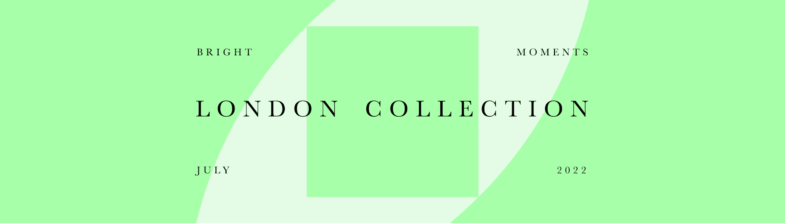

# Mint Pass London Collection | Emily Xie

The London Collection 是 Bright Moments 精选的六位领先数字艺术家，在伦敦市中心铸造 IRL。 每位艺术家都创造了一种身临其境的、独特的、模拟的风格来为他们的收藏制作输出。 薄荷通行证持有人有权从艺术家的伦敦收藏系列中获得铸造的 NFT，包括在 7 月份访问 13 Soho Square 以铸造 IRL 的机会。 亲自铸造将使您能够见到艺术家并共同创作作品。 如果在铸币窗口期间无法访问伦敦，铸币厂通行证持有人也可以远程铸币。 了解有关 Bright Moments Mint Pass 政策的更多信息。关于艺术家：谢是一位生成艺术家、工程师和教育家。 她使用算法和数据来探索有机和系统之间的相互作用。

