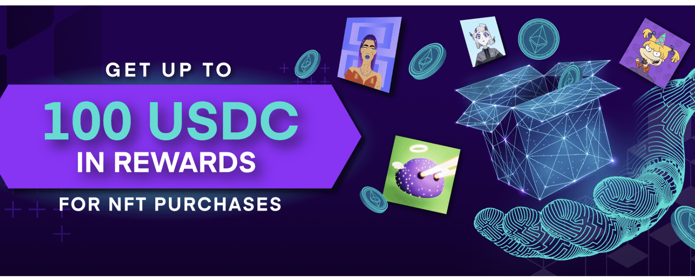

# Mintable

使用 Mintable.app 将您的创作变成区块链项目。

什么是 Mintable.app ？

Mintable.app 是一个 NFT（非同质代币）集合。存储在区块链上的数字艺术品集合。

有多少 Mintable.app  代币？

总共有 4,539 个 Mintable.app 。目前，2,614 位车主的钱包中至少有一个 Mintable.app  NTF。

 Mintable.app 最贵的促销是什么？

最昂贵的 Mintable.app NFT 是 [MZG Joint Snake](https://www.nft-stats.com/asset/0x8c5acf6dbd24c66e6fd44d4a4c3d7a2d955aaad2/27964339865592756430076624915131963380151013737378030755863877106843153667175)。它于 2022-08-30（5 天前）以 140.7 美元的价格售出。

最近售出了多少Mintable.app ？

过去 30 天内售出了 8 个 Mintable.app  NFT。

