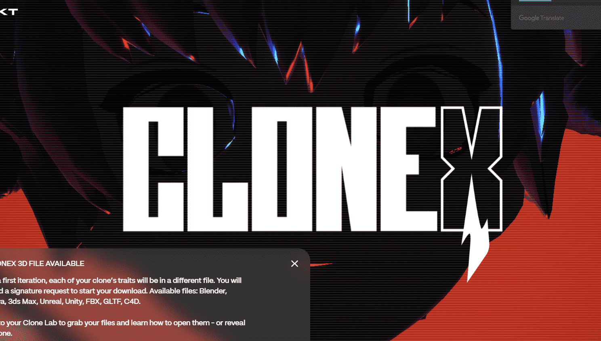

# RTFKT - Mintdisc 1

不要购买 Clonex，因为它们可能已经被兑换成薄荷小瓶。

预售现已结束，请勿为 Clone X 购买。

在第一次迭代中，每个克隆的特性将位于不同的文件中。您将需要一个签名请求开始您的下载。可用的文件:Blender,Maya,3ds Max,Unreal,Unity,FBX,GLTF,C4D。

到您的克隆实验室获取您的文件，并了解如何打开它们-或揭示一个克隆。

什么是 RTFKT - Mintdisc 1？

RTFKT - Mintdisc 1 是一个 NFT（不可替代令牌）集合。存储在区块链上的数字艺术品集合。

存在多少个 RTFKT - Mintdisc 1 代币？

总共有 751 个 RTFKT - Mintdisc 1 NFT。目前 583 位所有者的钱包中至少有一个 RTFKT - Mintdisc 1 NTF。

最昂贵的 RTFKT - Mintdisc 1 销售是什么？

售出的最昂贵的 RTFKT - Mintdisc 1 NFT 是 [Mintdisc (1) 💿](https://www.nft-stats.com/asset/0x20fd8d8076538b0b365f2ddd77c8f4339f22b970/347)。它于 2022 年 6 月 23 日（2 个月前）以 544.5 美元的价格售出。

最近卖出了多少 RTFKT - Mintdisc 1？

过去 30 天内售出了 5 个 RTFKT - Mintdisc 1 NFT。

