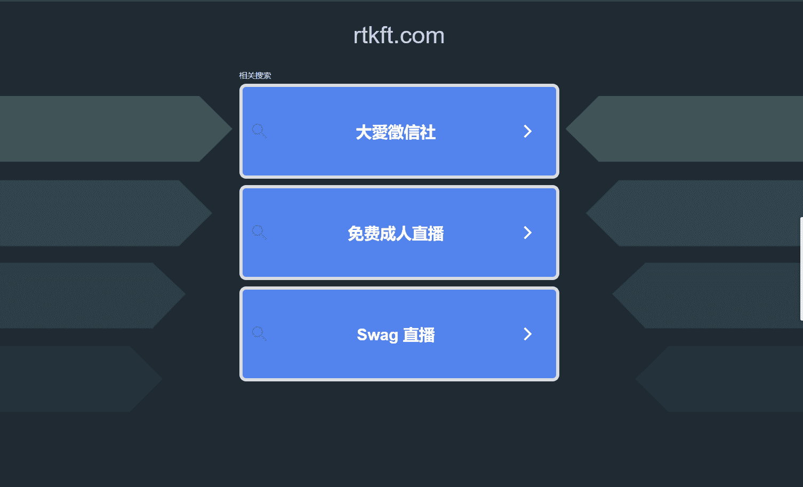

# RTFKT - Mintdisc 3

什么是 RTFKT - Mintdisc 3？

RTFKT - Mintdisc 3 是一个 NFT（不可替代令牌）集合。存储在区块链上的数字艺术品集合。

存在多少个 RTFKT - Mintdisc 3 代币？

总共有 817 个 RTFKT - Mintdisc 3 个 NFT。目前，444 位所有者的钱包中至少有一个 RTFKT - Mintdisc 3 NTF。

最昂贵的 RTFKT - Mintdisc 3 销售是什么？

售出的最昂贵的 RTFKT - Mintdisc 3 NFT 是 [Mintdisc (3) 💿](https://www.nft-stats.com/asset/0x25708f5621ac41171f3ad6d269e422c634b1e96a/309)。它于 2022-06-10（3 个月前）以 715.4 美元的价格售出。

最近卖出了多少 RTFKT - Mintdisc 3？

过去 30 天内售出了 8 个 RTFKT - Mintdisc 3 个 NFT。

