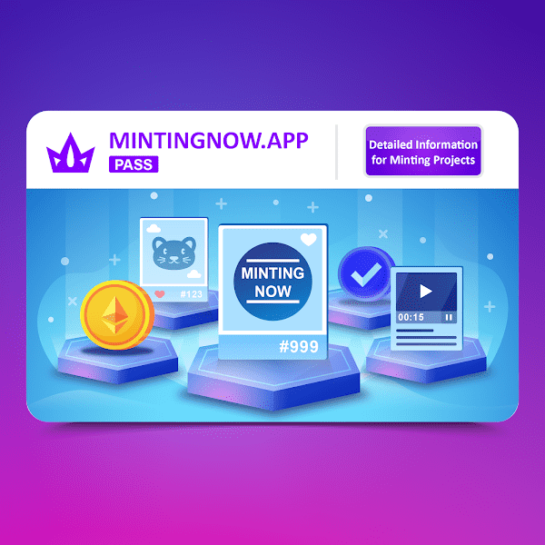

# Minting Now PASS

Minting Now PASS NFT - 常见问题（FAQ）
▶ 什么是 Minting Now PASS？
Minting Now PASS 是一个 NFT（Non-fungible token）集合。存储在区块链上的数字艺术品集合。
▶ Minting Now PASS 代币有多少？
总共有 2,500 个 Minting Now PASS NFT。目前，481 位所有者的钱包中至少有一个 Minting Now PASS NTF。
▶ 最昂贵的 Minting Now PASS 销售是什么？
出售的最昂贵的 Minting Now PASS NFT 是 MintingNow Pass。它于 2022-06-13（3 个月前）以 12.3 美元的价格售出。
▶ 最近卖出了多少 Minting Now PASS？
在过去 30 天内售出了 84 个 Minting Now PASS NFT。
▶ Minting Now PASS 的费用是多少？
在过去 30 天内，Minting Now PASS NFT 最便宜的销售额低于 2 美元，最高销售额超过 4 美元。Minting Now PASS NFT 的中位价格在过去 30 天内为 3 美元。
▶ 什么是流行的 Minting Now PASS 替代品？
许多拥有 Minting Now PASS NFT 的用户还拥有 Pig boss club Genesis、 Doodles 2.0、 APEVERSE Official和 LolliDicks。

