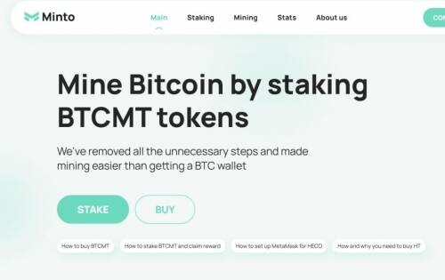
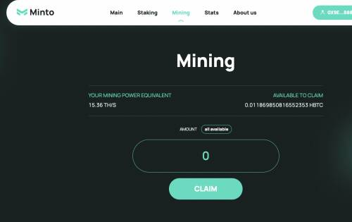
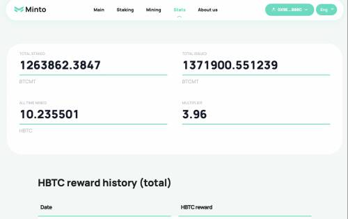

# Minto

Minto 是一个用于挖掘 BTC 的独特 DeFi 平台。Minto (BTCMT) 代币由 100 BTCMT = 1 TH/s 比率的真实采矿设备哈希率支持。Minto 允许用户通过质押 BTCMT 代币获得每日比特币收入。  

安全。DeFi 为您提供最高级别的安全性和匿名性，确保您的资产安全。环保的。Minto 数据中心是碳中和的，并且只提供环保比特币的开采。效率。所有开采的比特币每天都通过智能合约在 BTCMT 持有者之间自动分配。  

Minto 是一个国际团队，为比特币挖矿建立了一个高科技数据中心，容量超过 40.000 名矿工。Minto 使用不损害环境的水力发电厂的能源。Minto 密切关注能源行业，只使用碳足迹中性的可再生资源，因此所有开采的 BTC 都是环保的。Minto 提供了为普通人节省开支的最短方式，传统采矿对他们来说已经是禁区。所有排放的挖矿奖励仅在从整个哈希率中质押 BTCMT 的人之间共享。随着额外的计算能力连接到 Minto 项目并且总哈希率增加，奖励支出相应增加。绿色、有利可图、负责任。  

