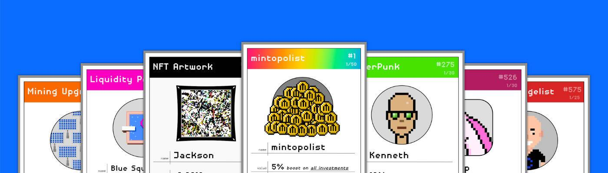

# Mintopoly!

小聚！NFT - 常见问题（FAQ）
▶ 什么是 Mintopoly！？
小聚！是一个 NFT（不可替代代币）集合。存储在区块链上的数字艺术品集合。
▶ 多少Mintopoly！代币存在吗？
总共有63个Mintopoly！NFT。目前 221 位业主至少拥有一台 Mintopoly！NTF 在他们的钱包里。
▶ 什么是最贵的 Mintopoly！销售？
最贵的Mintopoly！出售的 NFT 是 Mintopolist。它于 2022-07-31（29 天前）以 562.8 美元的价格售出。
▶ 多少Mintopoly！最近有卖吗？
有46个Mintopoly！过去 30 天内售出的 NFT。
▶ Mintopoly 多少钱！成本？
最近30天最便宜的Mintopoly！NFT 销售额低于 31 美元，最高销售额超过 58 美元。Mintopoly 的中位数价格！NFT 在过去 30 天内为 42 美元。
▶什么是流行的Mintopoly！备择方案？
许多拥有Mintopoly的用户！NFT 还拥有 Borks NFT、 Rapica、 I AM NOT BANKSY和 EtherFishing。

