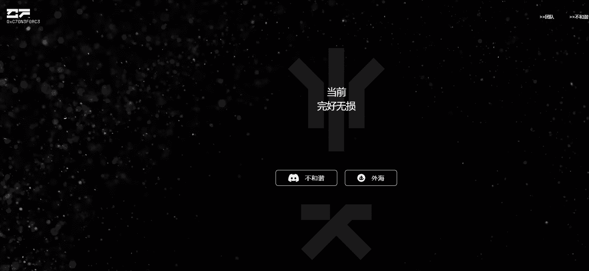

# CF: The Calling

一个信标，可以找到那些发誓保护区块链的人。该信标将在时间到来时召唤持有者。你会接电话吗？

Yobs 是一位多学科艺术家和有远见的艺术家。最出名的是他在豪华皮革制品上的精细定制油漆。自从开始为街头服饰定制运动鞋和服装。

Eddie 是格里芬动画学院的创始人和初级教育家。他拥有科廷大学媒体艺术背景，在视觉特效/动画行业工作了近 20 年。

Nox 是一位经验丰富的软件工程师，他在该行业已经工作了 10 多年。他是一名企业家，一名全栈开发人员，以及在他生活的各个方面都充满热情的学习者。

