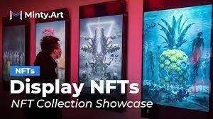

# Minty.art

Minty 正在重新构想艺术赞助。Minty 是一个使用区块链技术、去中心化金融 (Defi) 和不可替代代币 (NFT) 支持艺术品融资和交易的软件平台。 

Minty 赋予艺术家权力，让他们完全控制自己的工作。通过使用 Minty 的赞助计划，艺术家可以控制稀缺性、避免仿冒、享受版权保护、从他们的作品中创造多种收入收入并发挥他们的真正潜力。Minty 独特的数字赞助计划使收藏家和投资者能够帮助艺术家资助他们最新、最重要的项目。这使策展过程民主化，并允许艺术家更早地找到他们的部落和追随者。Minty 让艺术家和收藏家成为他们自己 - 激发创造力并为这个世界带来色彩。

