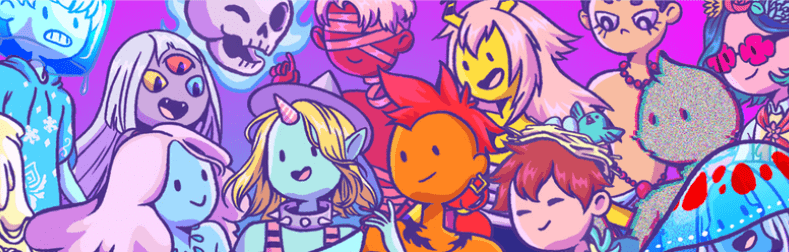

# The Magus World

一个光明而不确定的故事，始于它尚未盛行的魔力。从一个迅速转向另一个世界的世界开始。有利的意外永远无法预测，所以那些偶然发现一个世界，这个世界被刻意的、世俗的、世俗的本质所掩盖，直到现在，情况就是如此。
一个满脸皱纹、驼背姿势的男人，披着一件破烂的衣服，在树林里徘徊，寻找那些有命运，尚未实现的人。其中六个人被证明是最值得他神秘礼物的人。无法保留的礼物，但它会在接受它的人身上体现出来。通往另一个世界，魔术师，魔法世界的门户。
一个魔幻的世界，需要秩序来维持可能的混乱，总是潜伏在阴影中抓住一个纯净的灵魂，打破和谐。权力的概念，揭示了一个人的真实意图，或者可能是迄今为止隐藏在内心深处的情感。
为了阻止力量和元素，建立了魔法学校，为那些寻求它的人以及那些注定要成为这个世界的保护者的人提供法律和秩序。世间六种元素，水、火、自然、雷、光、暗。他们已经成为最强大的魔法师。曾经出生在一个如此肉体和明显的世界，但在另一个魔法师身上完成了难以想象的事迹。

