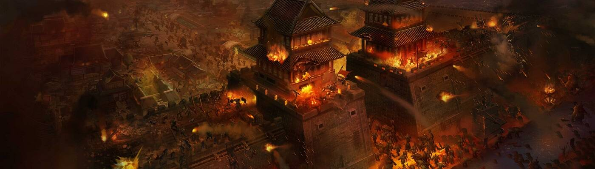

# MirLoot

Loot项目摒弃了浮华的画面和动作，充分适应区块链对存储和计算的限制，使得真正采用区块链开发去中心化游戏成为可能，作为开发者，深受启发，作为传奇爱好者，希望把传奇搬到区块链上，所有数据都在区块链上存储和计算，让传奇永远延续下去……

简介：项目将由NFT、FT、功能逻辑3类、多合约组成。NFT包括游戏装备、角色、行会、城池以及城池内的土地、设施等；FT指MIRG，即游戏金币，是游戏中各类活动的媒介，包括装备升级、创建行会、购买土地、发起挑战等，同时也是各类活动的奖励品，包括城池税收、行会会费、战斗奖励等；功能逻辑则包括实现各类游戏玩法的逻辑。

经济模式：初期MIRG只能通过销毁装备获得，数量随机，但装备等级越高获得的越多；装备公开销售，获取的装备等级随机，可能得到超高收益，每100件提升一个基础价格，使获取难度持续提升，所得收入主要用于回购MIRG，保证内循环，后续创建、升级各类NFT需消耗MIRG，使其持续减少、价格提升；后期可通过战力占领城池获得税收，激励玩家进一步购买高级装备或消耗MIRG提升战力……形成良性循环。

