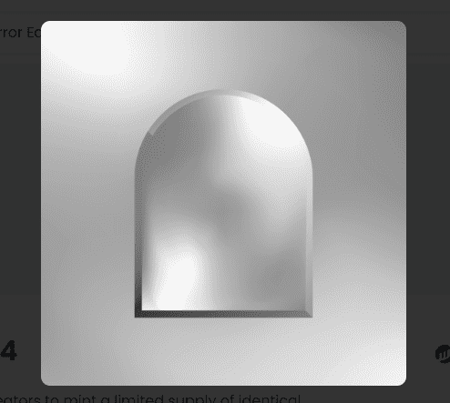

# Mirror Editions V4

镜像版是创作者以固定价格铸造有限供应的相同 NFT 的一种方式。如果 1/1 NFT 是苏富比的毕加索，那么版本就像发布的数千个第一版全息喷火龙。

Mirror Editions V4 NFT - 常见问题（FAQ）
▶ 什么是 Mirror Editions V4？
Mirror Editions V4 是一个 NFT（不可替代令牌）集合。存储在区块链上的数字艺术品集合。
▶ Mirror Editions V4 代币有多少？
总共有 1,026 个 Mirror Editions V4 NFT。目前，709 位所有者的钱包中至少有一个 Mirror Editions V4 NTF。
▶ 最近卖出了多少个Mirror Editions V4？
过去 30 天内售出了 0 个 Mirror Editions V4 NFT。
▶ 什么是流行的 Mirror Editions V4 替代品？
许多拥有 Mirror Editions V4 NFT 的用户还拥有 WELCOME TO VALHALLA、 Gaabgaab、 SUGAR MADDY MANDY和 Original sa-ard。

