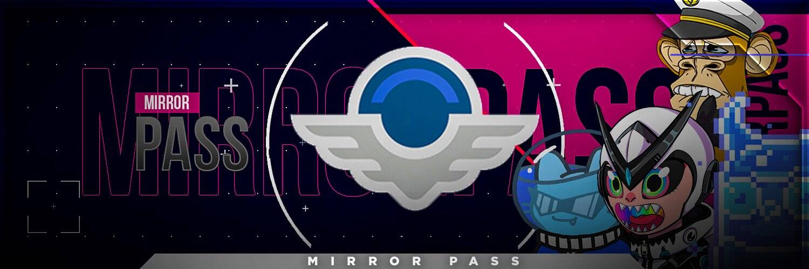

# Mirror Passes V2

每次通行证都可以独家访问从 Web3 空间中获得的最昂贵的知识。

我们通过以可承受的价格拆除任意墙来弥合鲸鱼和普通投资者之间的差距。

Mirror Pass V2 NFT - 常见问题（FAQ）
▶ 什么是 Mirror Passs V2？
Mirror Passes V2 是一个 NFT（不可替代令牌）集合。存储在区块链上的数字艺术品集合。
▶ 镜像通行证 V2 代币有多少？
总共有 1 个 Mirror Passs V2 NFT。目前 3 位所有者的钱包中至少有一个 Mirror Passes V2 NTF。
▶ 最近卖出了多少 Mirror Pass V2？
过去 30 天内售出了 0 个 Mirror Passes V2 NFT。

