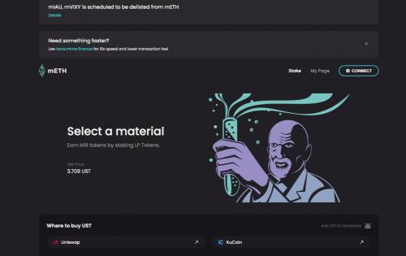
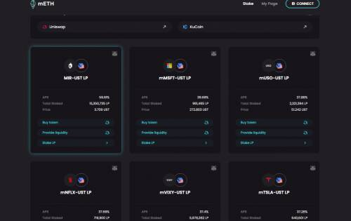
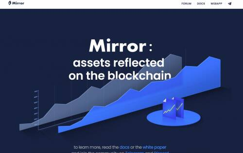

# Mirror

Mirror 是一种 DeFi 协议，由 Terra 网络上的智能合约提供支持，可以创建称为镜像资产 (mAssets) 的合成资产。mAssets 模仿现实世界资产的价格行为，让世界任何地方的交易者都可以公开获取价格敞口，而无需承担拥有或交易真实资产的负担。

mAssets 的铸造是分散的，由整个网络的用户通过开仓和存入抵押品来进行。Mirror 确保协议中始终有足够的抵押品来覆盖 mAssets，并且还通过在 Terraswap 上针对 UST 列出 mAssets 来管理 mAssets 市场。

镜像令牌（MIR）由协议铸造并作为奖励分发，以加强保护生态系统的行为。有了它，Mirror 通过向持有通过提供流动性获得的 LP 代币的用户奖励 MIR 来确保流动性 mAsset 市场。此外，为了激励用户确保 mAsset 模仿现实世界资产的价格行为，通过做空 mAsset 获得的 sLP 代币质押的用户将获得 MIR 奖励。MIR 很有价值，因为它可以被质押以获得投票特权并获得份额协议的 CDP 提款费用。

Mirror 是一个由其社区开发和指导的项目：其市场由其自己的用户通过 MIR 激励来维护，协议通过民主治理随着新思想的发展而发展。

