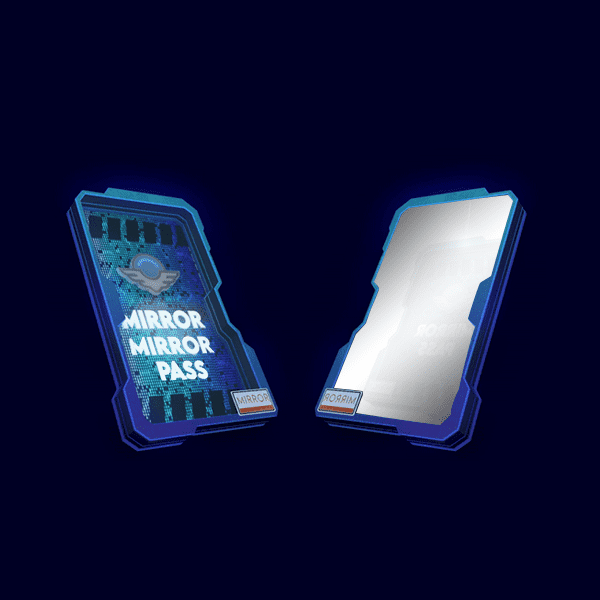

# MirrorMirror Pass

MirrorMirror Pass NFT - 常见问题（FAQ）
▶ 什么是Mirror Mirror Pass？
MirrorMirror Pass 是一个 NFT（Non-fungible token）集合。存储在区块链上的数字艺术品集合。
▶ Mirror Mirror Pass 代币有多少？
总共有 5,555 个 MirrorMirror Pass NFT。目前，2,305 位所有者的钱包中至少有一个 Mirror Mirror Pass NTF。
▶ 最贵的 MirrorMirror Pass 销售是什么？
最昂贵的 MirrorMirror Pass NFT 是 MirrorMirror Pass #4895。它于 2022-06-10（3 个月前）以 7.1 美元的价格售出。
▶ Mirror Mirror Pass 最近卖出了多少？
过去 30 天内售出了 32 个 MirrorMirror Pass NFT。
▶ Mirror Mirror Pass 需要多少钱？
在过去 30 天内，最便宜的 MirrorMirror Pass NFT 销售额低于 2 美元，最高销售额超过 6 美元。过去 30 天内，Mirror Mirror Pass NFT 的中位价格为 2 美元。
▶ 有哪些流行的 MirrorMirror Pass 替代品？
许多拥有 Mirror Mirror Pass NFT 的用户还拥有 Mirror Pass Genesis、 Moonbears NFT、 WhatThePhunks和 BoneHeadz Official。

