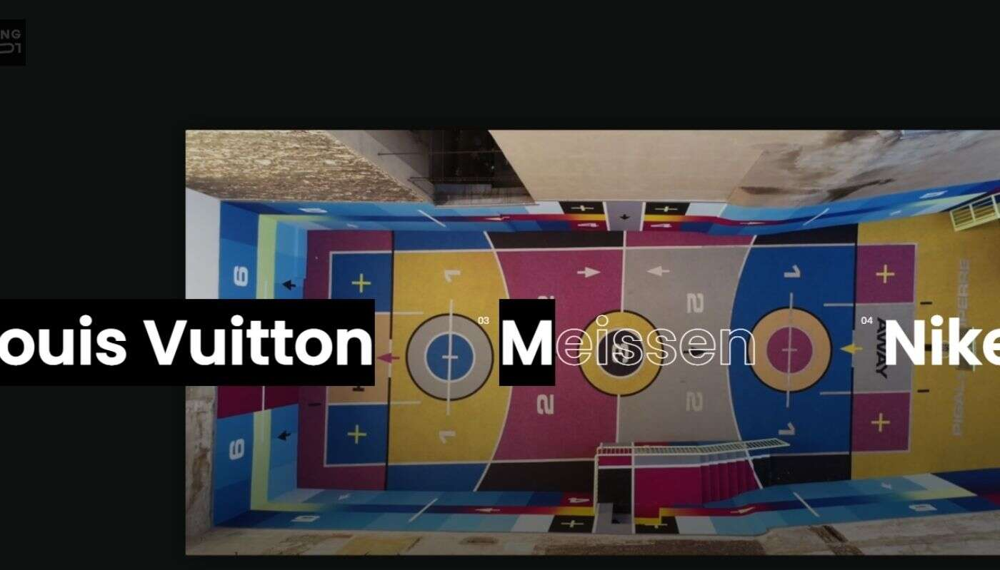

# LoopingLovers - INTIME

LoopingLovers - INTIME 系列包含两个时间胶囊：“EARLY”和“LATE”。循环的艺术品保留并构成了此刻漂浮的感觉。到达，发生，在应该的时候完成，而且永远不

会太早或太晚。

“EARLY”由 450 幅独特的静止人工智能艺术品组成，形成一个集体动画。表现出一种状态，在这种状态下，实现自我意识是了解自己以及了解自己与世界的关系的

能力。

**Loopinglovers 由数字艺术家 Philipp Ries 和 Thomas Mayer 组成。**

他们的工作围绕着在数字空间中漂浮和自由移动的类人生物展开，不受物理限制。核心元素是身体形状、平衡的颜色和纹理，通过无休止的循环运动，通过肢体语

言传达一种感觉，并且应该随着时间的推移而保持这种感觉。

他们设法创造出一种独特的风格，捕捉现实主义和超现实主义之间令人兴奋的对比，他们将其定义为数字感官。
