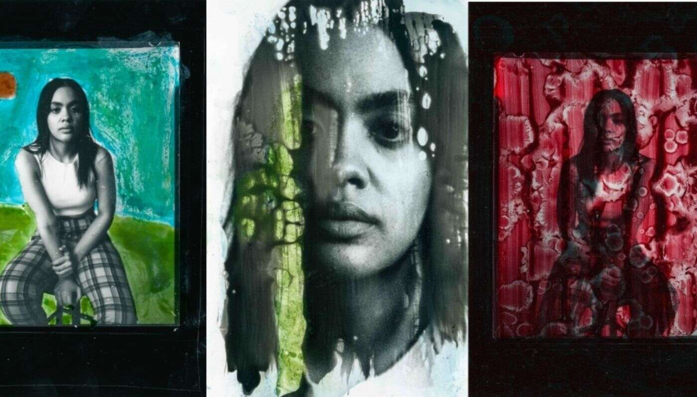

# MISFITS Collection

作为一名艺术家，你理解逃避现实。但在隐藏中，你磨练了你的手艺。进入流动状态。当达到心流状态时，每一件作品都成为一种探索或你的心灵。这个合作系列

是两位逃亡艺术家共同创作的作品，将两种截然不同的工艺结合在一个非常规的系列中。

MISFITS 是通过打破“正确”方式创建暗室打印的每一条规则而制作的。通过融合抽象绘画、模拟印刷工艺、少量火焰和许多迷失的夜晚，这个生成系列应运而生。

不涉及 Photoshop 或编辑软件。

整个系列都是由相同的 4x5 负片构成的。每次制作过程都会稍作改动，以创造出 33 幅永远无法复制的独特作品，即使是同一张底片。虽然他们共享同一个基地，

每件作品都有自己的创作故事。从画笔笔触到打印前后的图案障碍物，每一块都是模拟 1/1。

