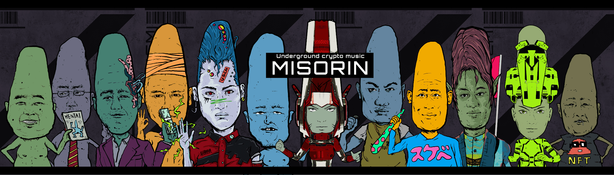

# Misorin

Misorin统计  创建于 3 个月前  22 代币供应  10% 费用
在过去的7天中，没有销售的Misorin。

#pfpm（个人资料图片音乐）#ugcm（地下加密音乐）

Misorin NFT-常见问题（FAQ）
▶什么是恶作剧？
存储在区块链上的数字艺术品集合。
▶存在多少个Misorin代币？
总共有22个Misorin NFT。目前，有18位主人在钱包中至少有一个Misorin NTF。
▶最近出售了多少个Misorin？
过去 30 天内售出 0 个 Misorin NFT。
▶流行的Misorin替代方案是什么？
许多拥有Misorin NFTS的用户还拥有 Yokaido， Tanpopo动漫， Maniyyugi Tokoyo角色和 触手恐怖。

