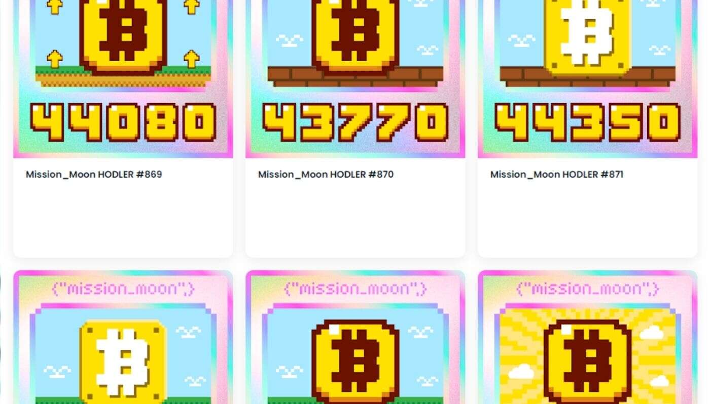

# Mission_Moon_40000_49990

**什么是 Mission_Moon_40000_49990？**

Mission_Moon_40000_49990 是一个 NFT（不可替代代币）集合。存储在区块链上的数字艺术品集合。

**有多少 Mission_Moon_40000_49990 代币？**

总共有 1,000 个 Mission_Moon_40000_49990 个 NFT。目前 1 位所有者的钱包中至少有一个 Mission_Moon_40000_49990 NTF。

**最近卖出了多少 Mission_Moon_40000_49990？**

过去 30 天内售出 0 个 Mission_Moon_40000_49990 NFT。

根据我目前的投资组合，我制作了所有这些收藏品，希望我持有的每一枚硬币都能很快到达月球。只要画出来，祈祷市场会继续牛市，让我的持股越来越多！

你有哪个硬币？让我们收集这些收藏品，等待宇宙飞船将它带到月球上的正确位置。

