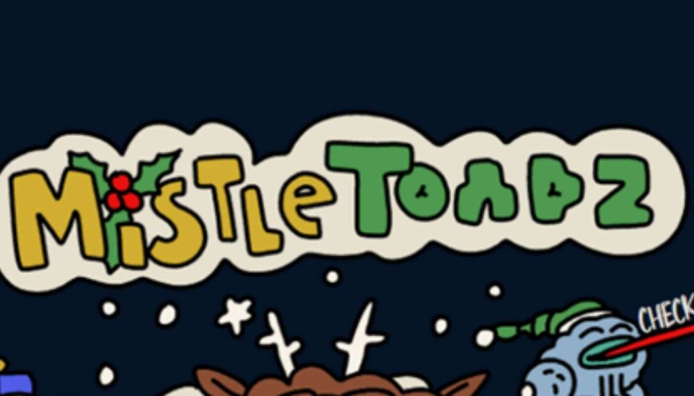

# MistleToadz by GREMPLIN

GREMPLIN NFT 的 MistleToadz 在过去 7 天内售出 3 次。GREMPLIN 的 MistleToadz 的总销售额为 197.4 美元。GREMPLIN NFT 的 MistleToadz 的平均价格为 

65.8 美元。GREMPLIN 拥有者有 1,854 个 MistleToadz，总共拥有 4,141 个代币。

在 2021 年的假日季节，从元宇宙中诞生的喜庆、长疣、两栖生物

**GREMPLIN 代币有多少 MistleToadz？**

GREMPLIN NFT 总共有 4,141 个 MistleToadz。目前，1,854 位所有者的钱包中至少有一个 GREMPLIN NTF 的 MistleToadz。

**GREMPLIN 销售的最贵的 MistleToadz 是什么？**

GREMPLIN NFT 出售的最昂贵的 MistleToadz 是 MistleToadz #6033。它于 2022-06-05（3 个月前）以 182 美元的价格售出。

**GREMPLIN 的 MistleToadz 最近卖出了多少？**

过去 30 天内售出了 33 个由 GREMPLIN NFT 开发的 MistleToadz。

**GREMPLIN 的 MistleToadz 需要多少钱？**

在过去 30 天里，GREMPLIN NFT 最便宜的 MistleToadz 销售额低于 27 美元，最高销售额超过 178 美元。GREMPLIN NFT 的 MistleToadz 在过去 30 天内的中位

数价格为 44 美元。

**GREMPLIN 流行的 MistleToadz 替代品有哪些？**

许多拥有 GREMPLIN NFTs 的 MistleToadz 的用户还拥有 Sukamii、 Choadz、 First First NFTs和 NotLarvaLads。
