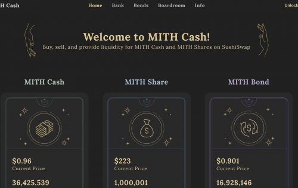
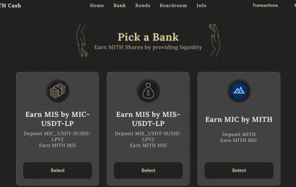

# MITH Cash

通过 MIC 的第一个通缩阶段，MIC 团队确定了在发行秘银债券 (MIB) 方面需要改进的领域。目前，该团队正在为此努力。我们与算法设计顾问讨论了发行新债券 (MIB) 的过程。预计新的发行流程将使MIC通货紧缩的目标能够更有效地实现。

以荷兰式拍卖的形式发行秘银债券 (MIB)。每个周期（周期的持续时间尚未确定。可能是 24 小时，但您必须等待最终决定）是荷兰式拍卖，每个周期都发行具有不同利率和期限的债券。债券有效期为 1/3/6 个月（不是最终期限）。

每个周期发行的债券数量由该周期的 TWAP 决定（这 24 小时的期限可能会根据每次荷兰式拍卖的时间而有所不同）。发行债券的公式如下：

TWAP = X（当 MIC 小于 1 美元时）

目标：焚化 (1-X)* MIC 流通量和市场供应量。该数量假定为 Y。

债券发行：（1 / 平均债券价格）* Y

MIC 社区根据 MIC 生态系统的参与者做出决策。在现行制度下，债券的发行效率较低，发行时间较长。这会给 MIC 池和 MIC 生态系统带来不必要的压力。然而，这可以通过一种新形式的秘银债券 (MIB) 来解决。

