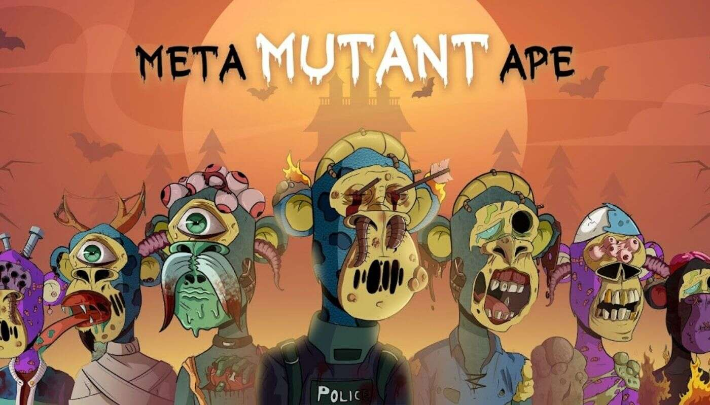

# MMutantApe

在对猿的致命实验出错后，变异的猿在诗句中被释放，一群侦探正在寻找野兽。这一可怕的事故成为一种全新的猿类物种——元突变猿诞生的原因。

过去 7 天内没有出售任何 MMutantApe。

总共有 821 个 MMutantApe NFT。目前，425 位所有者的钱包中至少有一个 MMutantApe NTF。

过去 30 天内售出 0 个 MMutantApe NFT。

Okay MutantApes 是 3,333 只猿的集合，它们在连接到以太坊区块链时发生了变异。

持有 Okay MutantApes 将让您通过镜像访问 Mutant Ape Yatch Club 和 Okay Bears alpha 聊天。

可以用 $APE 进行交易。

