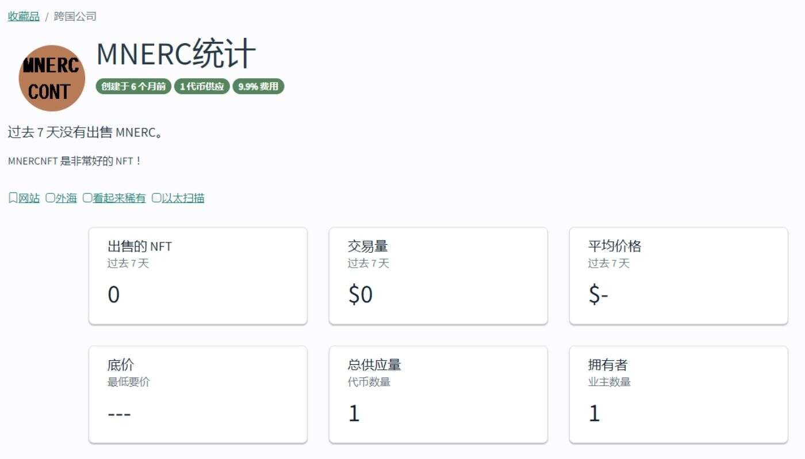

# MNERC

过去 7 天没有出售 MNERC。

MNERCNFT 是非常好的 NFT！

## 什么是 MNERC？

MNERC 是一个 NFT（不可替代代币）集合。存储在区块链上的数字艺术品集合。

## 有多少个 MNERC 代币？

总共有 1 个 MNERC NFT。目前 1 位所有者的钱包中至少有一个 MNERC NTF。

## 最近卖出了多少 MNERC？

过去 30 天内售出 0 个 MNERC NFT。

着陆顺利进行，现在您可以自由地在机舱周围走动并踏上……水星。这是船长说话。我们是精致的工人，肩负着在外太空寻找生命迹象和最好的 NFT 宝藏的使命。

他们在零重力 Instagram 模拟器中苦练了一整年的绘画和训练，现在是时候做真正的游戏了。我们每天发布 3 张优质插图作为独家 NFT 1/1。这些是在给定的调色

板和模板中创建的集体艺术作品的个人贡献。参与者不知道其他艺术家创作了什么。它是随机的，绝对是独一无二的。参加者：来自世界各地的90位艺术家。
