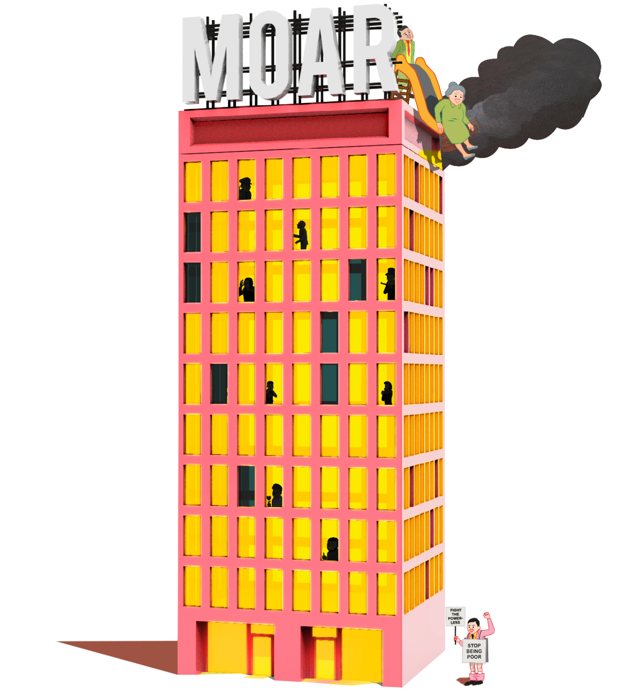

# MOAR by Joan Cornella NFT Collection

这是元宇宙中一座名为“MOAR”的豪宅的故事。这是一座建筑，其中有5，555种生物的灵魂使用ERC721区块链作为NFT铸造。虽然由于外星人的入侵，世界处于封锁状态，但住在MOAR的客人，包括人类，僵尸和半机械人，和平地生活在一起。

每一个都是独一无二的，由西班牙艺术家琼·科内拉（Joan Cornellà）使用180多种独特属性手绘而成。

MOAR是一个相当不寻常的豪宅，在那里你可以找到商店，游戏和虚拟展览。让我们一起见证最伟大的艺术和元宇宙体验之一。

