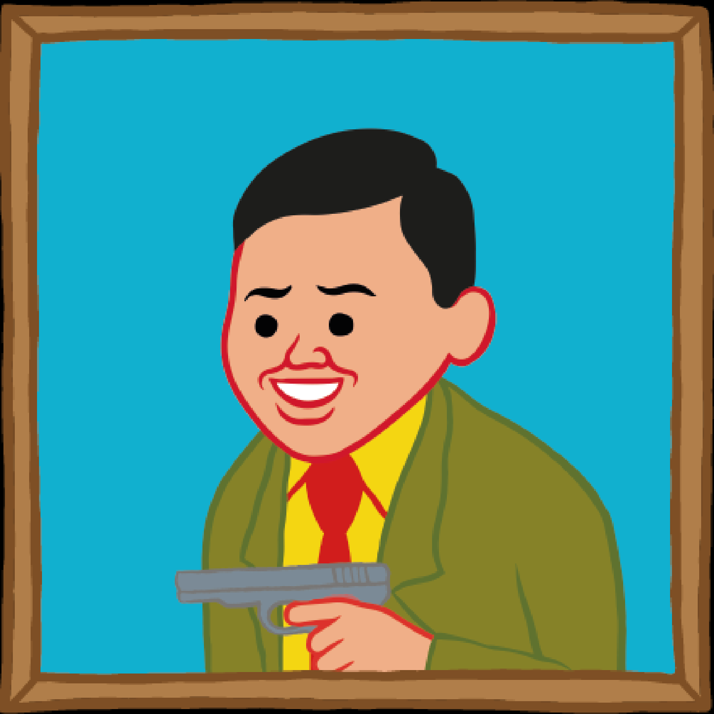

# MOAR by Joan Cornella

Joan Cornellà 的 MOAR 是由 FWENCLUB 自豪地呈现的虚拟世界中一座不寻常的豪宅，其中 5,555 个生物的灵魂使用 ERC721 区块链作为 NFT 铸造而成。这些“和平共处”的人类、机器人甚至僵尸都是独一无二的，由西班牙艺术家 Joan Cornellà 使用 200 多种独特属性手绘而成。您甚至可以找到商店、游戏、虚拟展览……还有 MOAR！

琼·科内拉·巴斯克斯（Joan Cornellà Vázquez，1981 年出生于巴塞罗那）是西班牙漫画家和插画家，以在他的标志性艺术品和漫画中使用强烈的黑色幽默而闻名。

