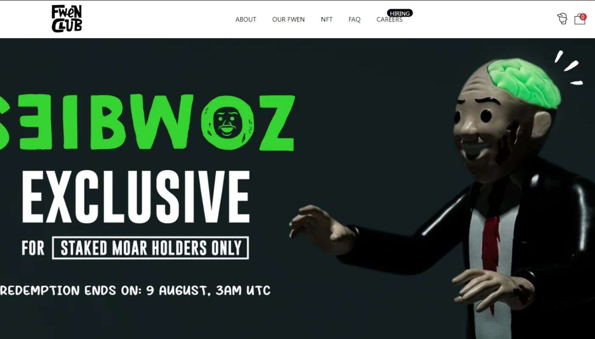

# MOAR Serum

MOAR Serum NFT 在过去 7 天内售出 39 次。MOAR Serum 的总销售额为 9.46 万美元。一份 MOAR Serum NFT 的平均价格为 242.5 美元。共有 2,839 名 

MOAR Serum 所有者，总共拥有 2 个代币。

总共有 2 个 MOAR Serum NFT。目前，2,839 名所有者的钱包中至少有一份 MOAR Serum NTF。

最昂贵的 MOAR Serum NFT 是 MOAR Serum-Green。它于 2022-06-30（2 个月前）以 435.7 美元的价格售出。

过去 30 天内售出了 39 个 MOAR Serum NFT。

在过去 30 天里，MOAR Serum NFT 最便宜的销售额低于 119 美元，最高销售额超过 351 美元。过去 30 天内，MOAR Serum NFT 的中位价格为 258 美元。

许多拥有 MOAR Serum NFT 的用户还拥有 HAZEY-Mostly Monochrome、 PeopleInThePlaceTheyLove、 HEX TOYS和 NOTHINGNESSNOTHING。
