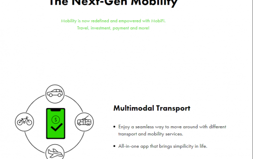
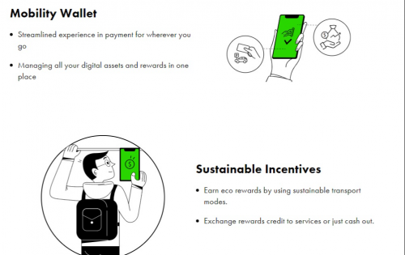
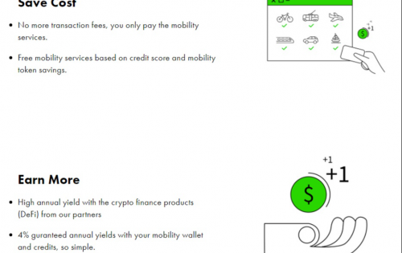

# MobiFi

Mobifi的故事刚刚开始，SmartMob赢得了 2019年荷兰移动Hackathon 。该活动的挑战是填补现有的移动基础设施中的公共交通和私人汽车使用之间的空白。换句话说，他们如何结合漏水和公共交通工具以提高旅行效率？

获胜的想法是简化公园和骑行体验，并将其他选项（例如，将踏板车，电车，巴士）整合到一个应用程序中。活动结束后，一些团队进一步提出了这个想法，并研究了区块链技术如何帮助解决城市流动性挑战。快进一年，而Mobifi出生了。

在与许多最终消费者和移动服务提供商互动之后，我们了解到出行决策在很大程度上是非理性的，而且很难改变根深蒂固的习惯。各种公司都尝试了不同的行为改变激励措施，但是在大多数情况下，一旦激励措施停止，他们就停止工作。

因此，他们正在寻找一种诱使用户迈向可持续性的新方法，同时还要简化运输体验。

在他们参与瑞士苏黎世的 F10 孵化器和加速器期间。他们创建了 MobiFi，一种基于加密的支付和投资解决方案，一种新的移动金融工具。

