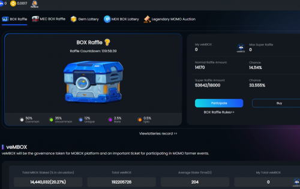
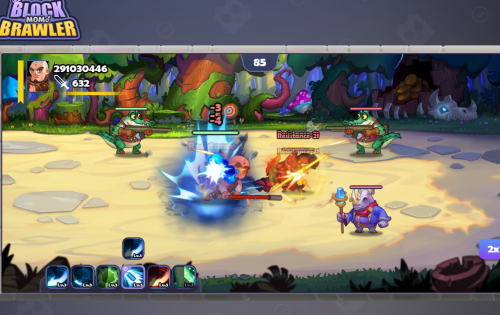
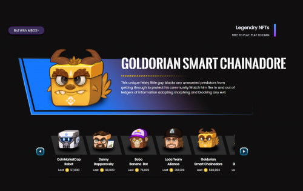

# MOBOX: NFT Farmer

游戏应该很有趣。不必考虑您花费的每一分钱并占用您所有的时间，玩赚钱不是很好吗？

‌MOBOX 建立了一个独特的基础设施，建立在不断发展的DeFi 生态系统之上，并通过独特的 NFT将其与游戏相结合。使用流动性池、收益农业和 NFT，GameFi 基础设施不仅可以为用户找到最佳收益策略，还可以生成可在众多游戏中使用的独特 NFT。这为 MOBOX 用户提供了一种独特的免费游戏能力并在一个单一的过程中获得收益。

‌想象一下一系列游戏，您实际上并没有花费辛苦赚来的钱来购买游戏内资源或英雄，而是一个储蓄账户，您储蓄的越多，您获得的资源就越多，您可以召唤的英雄就越多。

‌通过为某些 CRATES（矿池）提供流动性，CRATE 合约将通过利用最佳收益耕作策略自动为用户提供最佳收益。

