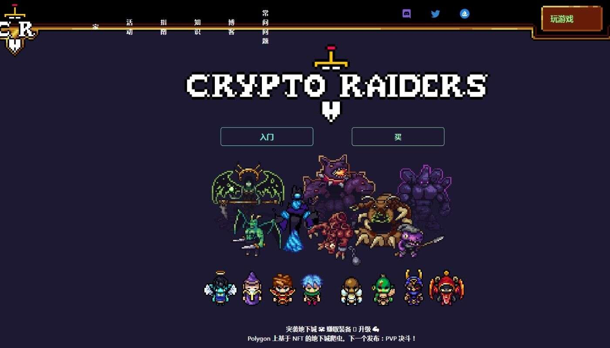

# CryptoRaiders MOBS Claim Pass

Crypto Raiders MOBS NFT 在过去 7 天内售出 3 次。Crypto Raiders MOBS 的总销售额为 755.54 美元。一份 Crypto Raiders MOBS NFT 的平均价格为 251.8 美

元。有 1,601 名 Crypto Raiders MOBS 所有者，拥有总供应量 12,562 个代币。

CryptoRaiders 是一款基于实用程序的 NFT RPG 游戏，您可以在其中突袭每周的地牢以获取装备和战利品，但要小心……死亡是永久性的 ☠️

这是官方的 CryptoRaiders Polygon MOBS认领通行证合集。

我们已经推出了社区喜爱的 5 个地下城，但现在是时候在激动人心的 4 地下城第一幕中将地下城和故事情节交织在一起了。

我们在多年的时间里构建游戏，是时候将我们的游戏移植到一个可以与我们一起扩展的引擎上。这是一项我们正在大力投资的大工程。
