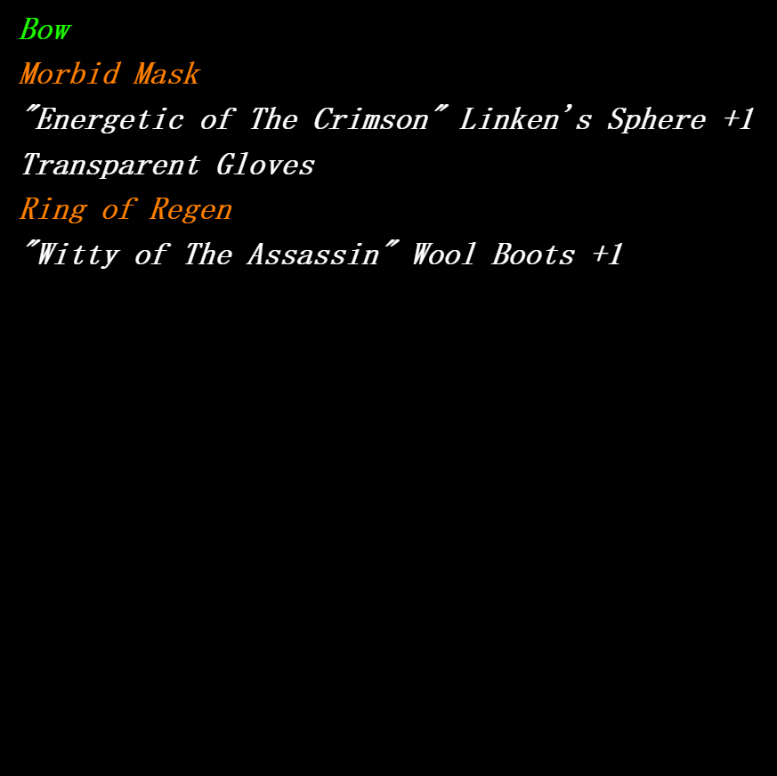

# MOCK_LAND

MOCK_LAND是一个自由而迷人的避难所，它正在邀请你。MOCK是一个探险家的装备，随机铸造并存储在链上。除了在颜色上显示装备的等级外，数据、图像等功能都被特意去掉了。请以您想到的任何方式使用 MOCK 并玩得开心。MOCK_LAND NFT - 常见问题（FAQ）
▶ 什么是 MOCK_LAND？
MOCK_LAND 是一个 NFT（不可替代代币）集合。存储在区块链上的数字收藏品集合。
▶ 有多少MOCK_LAND代币？
N个有6,96个MOCK_LAND目前，483位的钱包中至少有一个MOCKLAND NTF。
▶最近最多？MOCK_LAND
过去30个卖_出0个MOCKLAND NFT。

