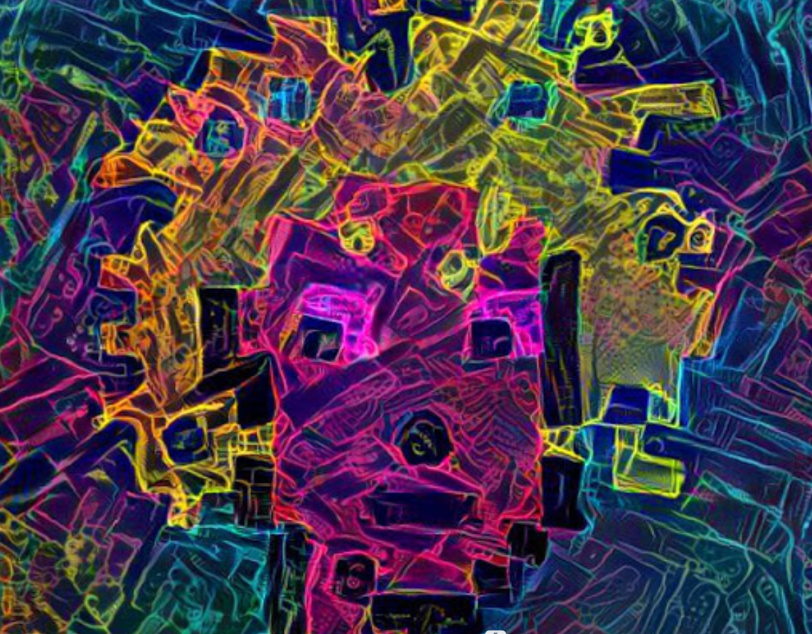

# Modern Guys Punks

现代艺术克朋是在人工智能的帮助下加密朋克的数字艺术。只有 123 个可用。每个都是唯一的 1/1 NFT。该项目不属于 Larva Labs。

2021 年 4 月 日 更新 - 美国标准时间下午 4:45

96%的第一滴产品已售出。
剩下待售的是第一滴的#022、#024、#048和#073。
新的水滴#037、#096和#101到#123刚刚添加到收藏中。
不会再创造更多了。 为 123。

▶ 什么是现代艺术朋克？
Modern Art Punks 是一个 NFT（不可替代代币）系列。存储在区块链上的数字收藏品收藏。
▶ 有多少现代艺术朋克代币？
NT有现代艺术朋克123个NFT现在，60个位的未来中至少有一个现代艺术双关语。
▶ 最昂贵的现代艺术朋克拍卖会是什么？
出卖最贵的 Modern Art Punks NFT 是 Modern Art Punk #007。它于 2022-08-30（大约 6 小时前）以 210.9 美元的价格售出。
▶ 最前沿？多么现代的艺术艺术
过去 30 款共售出 1 款 Modern Art Punks NFT。

