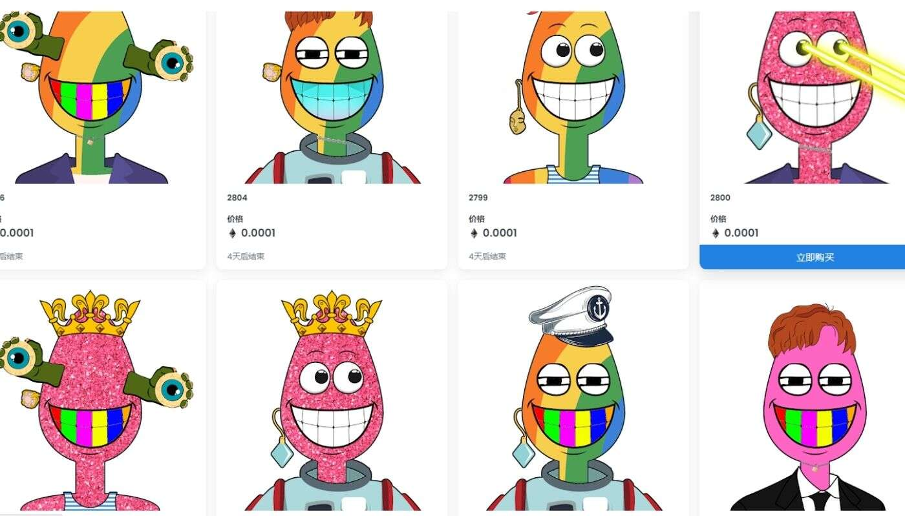

# Modern Degenz Yacht Club

Modern Degenz 游艇俱乐部是 3,501 艘独特的 Modern Degenz 的集合。

过去 7 天内没有出售 Modern Ape 游艇俱乐部。

限量 1000 只 Apes 的系列 - 发现此系列中最好的物品。

总共有 1,000 个 Modern Ape Yacht Club NFT。目前，16 位船主的钱包中至少有一个 Modern Ape Yacht Club NTF。

LoopieLooNFT 是 9,663 个（WOOF 的电话代码）肖像，它们在以太坊区块链的边缘过着最美好的生活。这些野蛮的 NFT 不能用任何所谓的“路线图”来控制，不

能用任何“实用程序”来限制，也不能被限制在一些无聊的 web2“网站”中。一个 Twitter 帐户偶尔会报告他们的行踪，这就是他们将遵守的一切。LoopieLooNFT 基

本上是一群在链条上漫游的坏蛋，放牧他们一路上发现的所有散乱的 1/1 varmints，只是为了运动。每个幻觉狗狗的数码相框都为这些野兽增添了一丝优雅；它们

将成为全球 degen ETH 钱包的精美、美观、有吸引力的现代艺术添加物。像小狗一样高贵，当然每只都不是一只，不是两只，而是三只与狗有关的莎士比亚名

言。每个 LoopieLooNFT 都带有一个由 1,000 多个可能的单词生成的独特名称，并且将它们与犬类虚拟世界中的其他任何东西区分开来。

