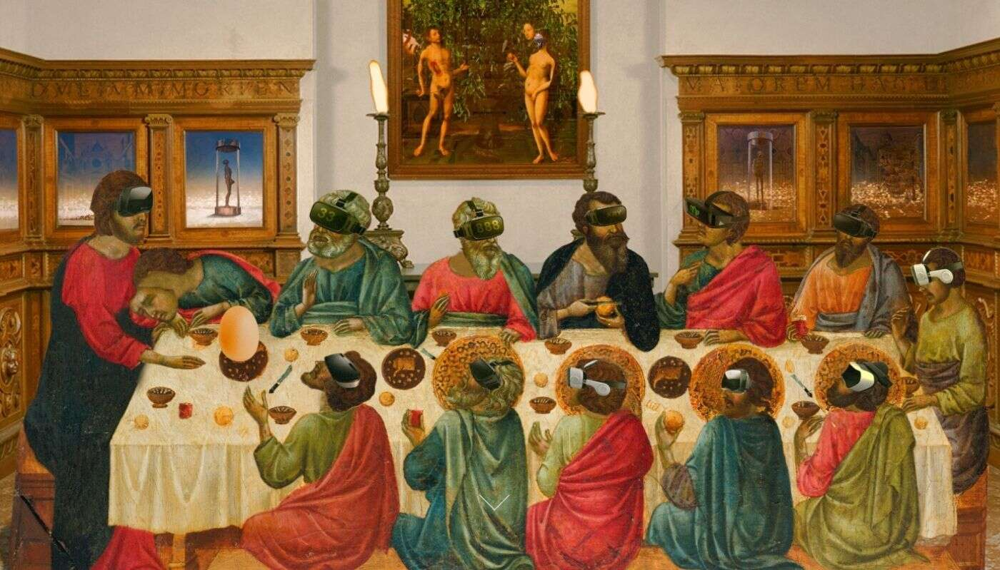

# Modern Renaissance Frens

Modern Renaissance Frens NFT 在过去 7 天内售出 5 次。Modern Renaissance Frens 的总销售额为 1.21 万美元。一个 Modern Renaissance Frens NFT 的平

均价格为 241.5 美元。有 83 名 Modern Renaissance Fren 所有者，总共拥有 22 个代币。

在 22 周内每周 1 法郎

出售的最昂贵的现代文艺复兴 Frens NFT 是 MRF XII-Leonardo Deglich。它于 2022-06-07（3 个月前）以 725.5 美元的价格售出。

过去 30 天内售出了 54 个 Modern Renaissance Frens NFT。

在过去 30 天里，Modern Renaissance Frens NFT 最便宜的销售额低于 242 美元，最高销售额超过 400 美元。Modern Renaissance Frens NFT 的中位价格在过

去 30 天内为 259 美元。

许多拥有 Modern Renaissance Frens NFT 的用户还拥有 Elispri x Editions、 NACHO BAR、 BASQKEK EDITION 1155和 Archan Nair。

我是 Afonso Caravaggio 意大利-巴西独立视觉艺术家、模拟摄影师和艺术总监。 

我的艺术是当旧与新相遇时，它融合了当今时代反映的文艺复兴时期的思想，以及当今时代的时事

欢迎来到现代文艺复兴
