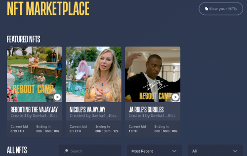

# Mogul Productions

Mogul 是面向电影和娱乐行业的全球 NFT 市场和 DeFi 平台。Dapp 允许代币持有者对电影进行投票，以从其 NFT 市场融资和购买 NFT。NFT 市场为社区所有，部分费用给 STARS 代币持有者

Mogul Productions 是一个去中心化的电影融资 (DeFiFi) 和基于电影的 NFT 平台，它将创作者、电影粉丝和电影金融家连接在一个空间中，以确保通过让每个人都有发言权来制作最好的电影。通过利用区块链技术、NFT 和代币化系统，Mogul 鼓励参与并奖励参与。使用 Mogul 应用内支付和实用代币 (STARS)，用户可以投票、批准和参与生产的关键决策方面。

Mogul Productions 是一家年轻、令人兴奋的公司，致力于在我们所做的事情上做到最好。我们是开放的沟通者，默认情况下具有包容性，是一家管理结构扁平且注重效率的公司。

