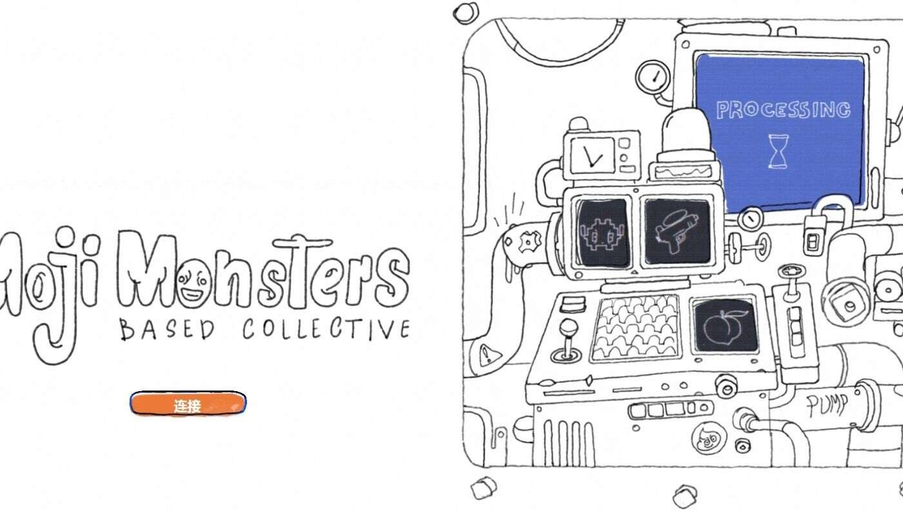

# Mojimonsters

Mojimonsters NFT 在过去 7 天内售出 1 次。Mojimonsters 的总销售额为 11.12 美元。一个 Mojimonsters NFT 的平均价格为 11.1 美元。有 2,141 名 

Mojimonsters 所有者，拥有 10,000 个代币的总供应量。

10,000 个二维表情符号组合融合成可收藏的怪物。他们会永远爱你……我们认为。

## 什么是Mojimon？

- 二维表情组合，融合成怪物
- 每个 Mojimonster 都有一个头部/身体/物品
- 结果可能会有所不同👀
- 您的 Mojimon 将永远爱您……我们认为

## 主要采用销售！

- 8,800 颗莫吉种子
- 每个 Mojiseed 0.09 ETH
- 孵化将在铸造期间发生
- 太平洋标准时间 8 月 25 日中午 12 点（UTC-8）
