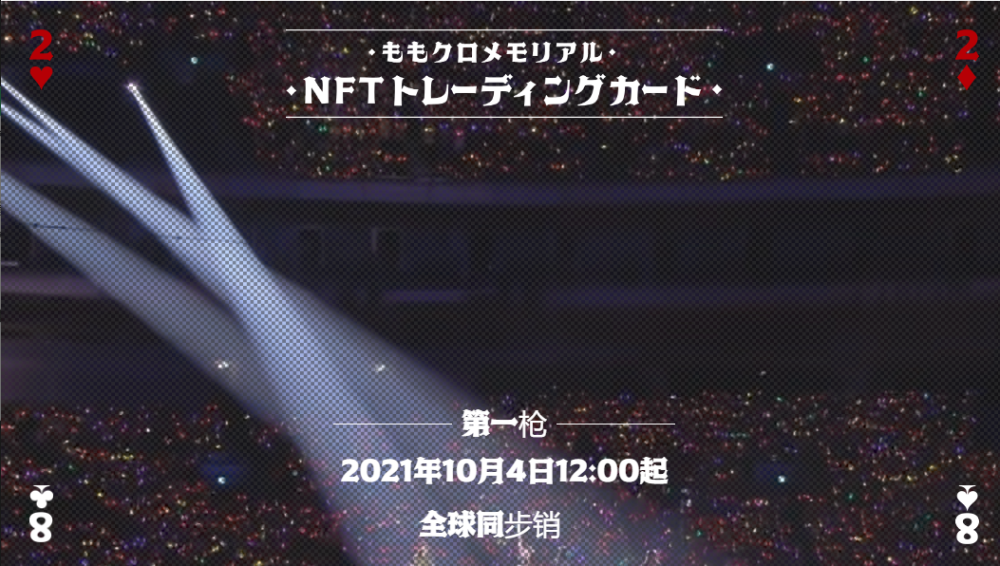

# MOMOCLO NFT CARD

NFT 是
“具有不可伪造的评估/所有权证书的数字数据”。与加密资产（虚拟货币）一样，它们在区块链上发行和交易。区块链上的数字数据变得难以复制和篡改，赋予数字数据资产价值成为可能。<在OpenSea购买

获奖者的钱包地址将在官网公布。

请获奖者在官方网站上的表格上填写必要的信息。请填写您的姓名、地址、电话号码、电子邮件地址和钱包地址，并用您的钱包签名。

我们将通过验证表格中输入的钱包地址信息来验证获胜者的身份。请在 11 月 18 日之前填写表格。（如果您在此之后填写表格，您将没有资格获得福利。）

我们将根据您在表格中输入的信息发送福利。

获奖者将在 10 月 18 日通过电子邮件收到通知。（如果您未被选中，您将不会收到电子邮件。）

我们将根据您在 PassMarket 购买时输入的详细信息发送福利。

