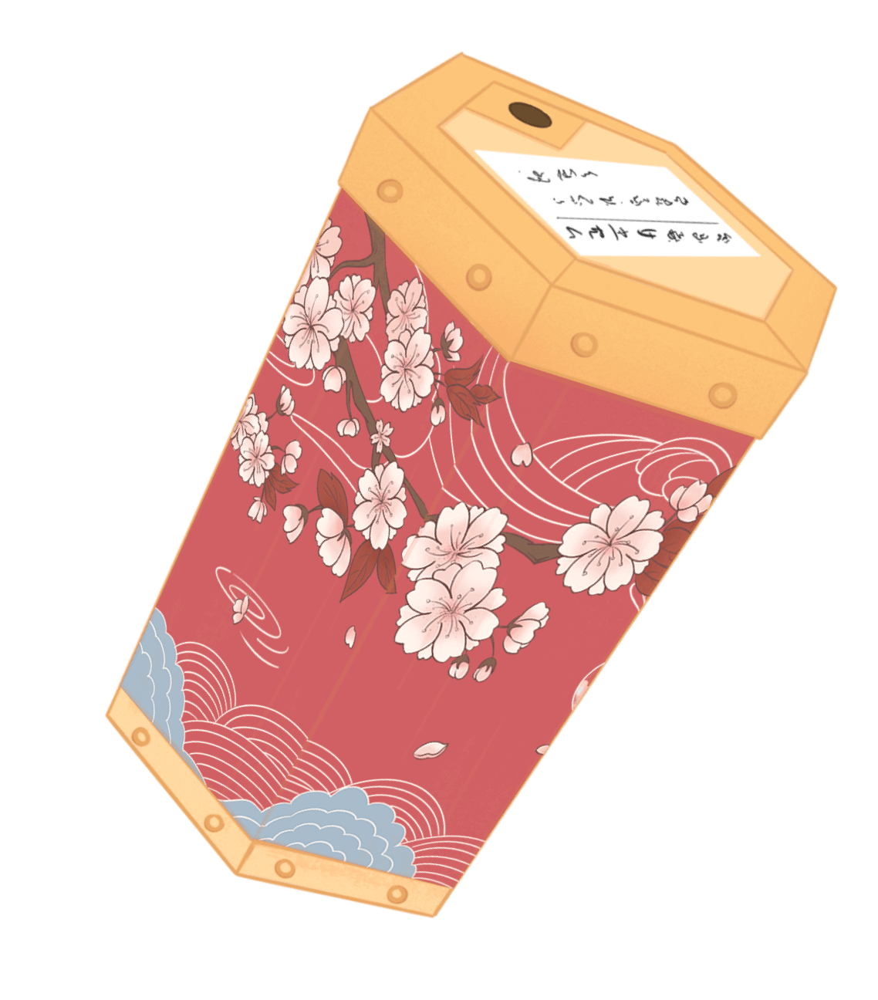

# MOMOCO(OFFICIAL)

羽生从小就和莫莫科一起长大。他们从白天到黑夜，从春天到冬天在浅草寺共度时光。然而，浅草寺百年不变的风景，却让羽生有了走出去的念头。然后，他离开了五年，没有任何回应。

Momoco从小就有成为世界顶级画家的梦想。和她一起长大的羽生结弦，不仅是她梦想背后最大的支持，更是她默默爱着的人。她认为，这辈子和她爱的人一起守住浅草寺的周围就足够了。然而，羽生离开浅草寺五年。 Momoco等了五年。

