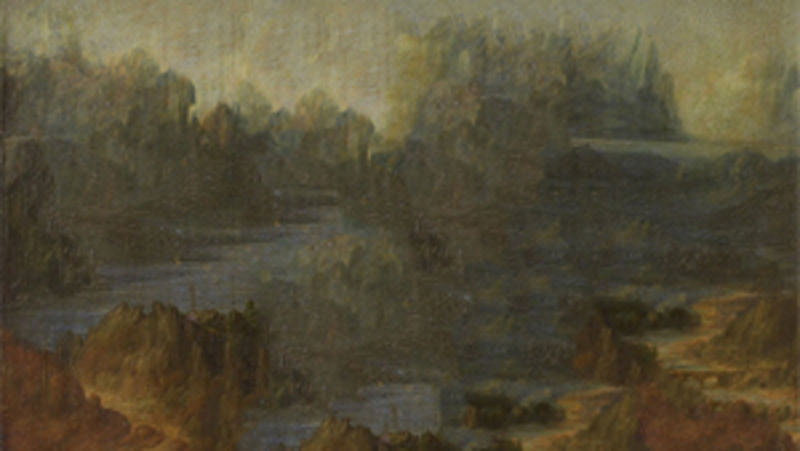

# MONA CAKE

几个世纪以来，蒙娜丽莎一直在休息。直到现在。 莫娜非常饿，决定吃蛋糕作为她的第一餐。 结果她几个世纪没有吃东西，她把蛋糕涂满了脸。

MONA CAKE NFT - 常见问题（FAQ）
▶ 什么是蒙娜蛋糕？
MONA CAKE 是一个 NFT（不可替代代币）集合。 存储在区块链上的数字艺术品集合。
▶ 有多少 MONA CAKE 代币？
总共有 1,999 个 MONA CAKE NFT。 目前，487 位业主的钱包中至少有一个 MONA CAKE NTF。
▶ 最近卖了多少 MONA CAKE？
过去 30 天内售出 0 个 MONA CAKE NFT。
▶ 什么是流行的 MONA CAKE 替代品？
许多拥有 MONA CAKE NFT 的用户还拥有 Metaspace_Golden、The Somethings - A Deed To The Realm、F4444444 和 Project Glitchpop。

