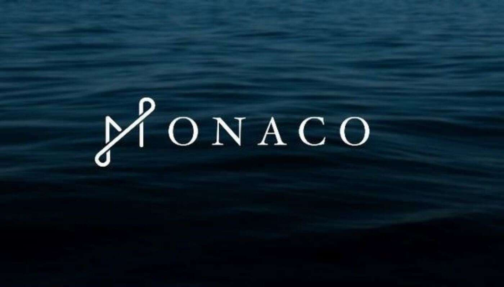

# Monaco Planet Yacht

Monaco Planet Yacht NFT 在过去 7 天内售出 94 次。Monaco Planet Yacht 的总销售额为 2.74 万美元。Monaco Planet Yacht NFT 的平均价格为 29.2 美元。摩

纳哥星球游艇拥有者 4,709 名，总供应量为 9,999 枚。

下一代 SocialFi 平台 Monaco Planet 在 Monaconft.io 发行了 10,000 个 Yacht NFT。

与其他基于头像的 NFT 不同，Yacht NFT 是第一个由加密原生平台支持和授权的 NFT。

对于 Monaco SocialFi 平台的创世用户，NFT 持有者将是“内容挖掘”的最初受益者。

Monaco Planet 是一个真正的 DAO，由社区管理和拥有。

生活充满挑战，但对于摩纳哥星球的居民来说，生活就像一个梦想，拥有自己的私人游艇，驶向日落。
