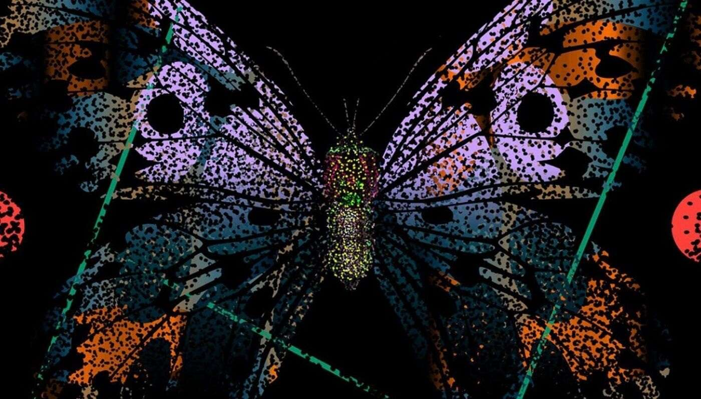

# Monarchs.Art

Monarchs.Art NFT 在过去 7 天内售出 3 次。Monarchs.Art 的总销售额为 695.02 美元。Monarchs.Art NFT 的平均价格为 231.7 美元。共有 604 位 

Monarchs.Art 所有者，总共拥有 888 个代币。

Monarchs 是 Eric Hu 和 Roy Tatum 的限量版生成蝴蝶 NFT 系列。可作为静止图像和动态图像查看，每件艺术品都有一只独一无二的蝴蝶，具有不同的翅膀形

状、颜色、身体和图案——一些特征比其他特征少得多。

Monarchs 从以太中自发出现，Monarchs是Eric Hu 和 Roy Tatum的 888 个生成NFT的限量版系列。每件艺术品都有一只独一无二的蝴蝶，它们的翅膀形状、颜

色、身体和图案各不相同。
