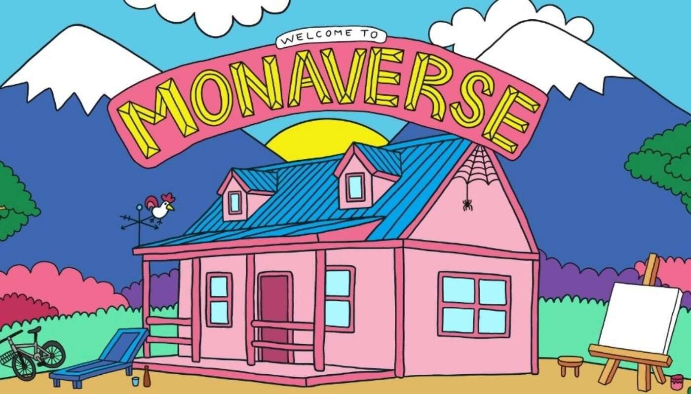

# Monaverse

Monaverse NFT 在过去 7 天内售出 5 次。Monaverse 的总销售额为 984.75 美元。一个 Monaverse NFT 的平均价格为 196.9 美元。有 632 个 Monaverse 所有

者，拥有 1,234 个代币的总供应量。

Monaverse 收藏了 1,234 个受蒙娜丽莎启发的艺术人物。每个 Mona 都是由我们自己的艺术总监 basloveyou 独特而巧妙地手绘而成，他的愿景是以滑稽和现代

的形式重新呈现古典艺术，供未来世界欣赏。

该路线图概述了我们的目标以及我们希望将 Monaverse 带到哪里。我们有很多想法和概念正在研究中。它可能会随着时间的推移而发展，并希望变得更好！

有什么更好的方式来激发更多的创造力？饮料！对于那些知道它是如何工作的人来说，这肯定是有道理的。那些不这样做的人，无论您身在何处，都可以与我们一

起庆祝。干杯!

获取您的 Mona 的独家高清打印。把它框起来，让她的微笑照亮你的房间。

准备好认识莫娜了吗？我们正准备让 Monamore 的梦想成真。展会指日可待，与您在世界各地相会。

巴斯和画廊工作人员正在准备一些神奇的东西。恢复和振兴在世界上留下印记的灵魂。准备好迎接第 2 章的到来。

是时候让 Monamore 喘口气，享受一段奇妙的旅程了。我们了解到，静静地凝视我们的 Mona，品酒的 3s，并与 Monamore 一起参加社区活动是多么令人满

意。未来是光明的，当 Mona 和 Monamore 通过发现和实现难以想象的事情共同铺平道路时，它会更加光明。

我们将向一位幸运持有人赠送一张特殊的复古裱框 Mona 画布。我们重视为我们提供价值的人。
