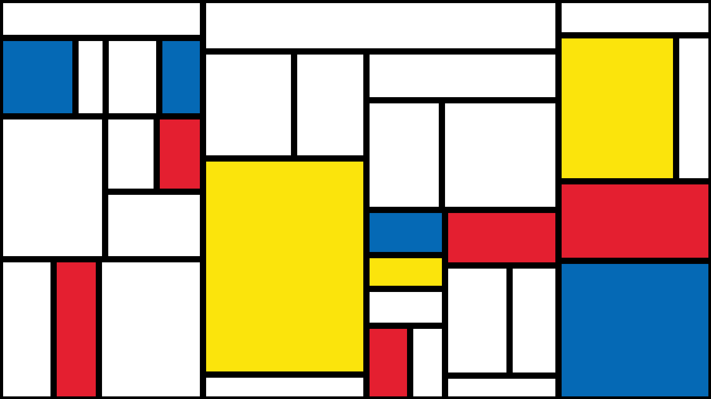

# MondrianArt

ColorRenderStudio 创作的 3333 幅蒙德里安艺术作品。

MondrianNFT是4096 Provable-Rare Generative Mondrian-Inspired Vector NFT Abstracts的集合。跨越Piet的多种风格，阶段和格式，稀有性反映了他的现实世界收藏。

Art101.io的MondrianNFT准确地反映了Mondrian收藏的每个阶段，作为生成无限可扩展的矢量图形。（包括 PNG）它由Art101的Carty Sewill（CartySewill.com）创建，它不仅仅是计算机生成的块。

通过添加加密旋转，蒙德里安NFT是一个有趣的高保真致敬。MondrianNFT.io 是一种对生成艺术的人文主义演绎。每个都有小瑕疵，如开裂的油漆和锯齿状的线条。您可以使用Inkscape等FOSS软件轻松编辑和检查MondrianNFT。

