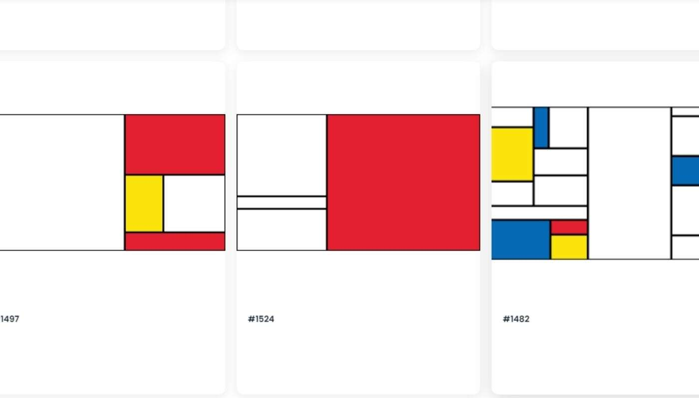

# MondrianByCR

过去 7 天没有出售 MondrianNFT。

MondrianNFT 是 4096 个可证明的稀有生成 Mondrian 启发向量 NFT 摘要的集合。跨越了 Piet 的多种风格、阶段和格式的全部，反映了他的真实世界收藏的稀有

性。Art101.io 的 MondrianNFT 将 Mondrian 收藏的每个阶段准确地反映为生成的无限可缩放矢量图形。（包括 PNG）由 Art101（https://art101.io）的 Carty 

Sewill (CartySewill.com) 创建，它不仅仅是计算机生成的块。

Mondrian NFT 添加了加密旋转，是一种有趣的高保真敬意。MondrianNFT.io 是对生成艺术的人文主义观点。每个都有小瑕疵，如破裂的油漆和锯齿状的线条。

您可以使用 Inkscape 等 FOSS 软件轻松编辑和检查 MondrianNFT。

总共有 4,096 个 MondrianNFT NFT。目前，1,834 位所有者的钱包中至少有一个 MondrianNFT NTF。
