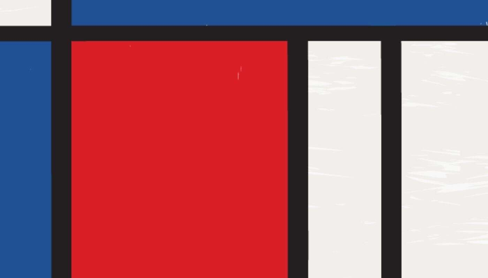

# MondrianNFT

MondrianNFT 是 4096 个可证明的稀有生成 Mondrian 启发向量 NFT 摘要的集合。跨越了 Piet 的多种风格、阶段和格式的全部，反映了他的真实世界收藏的稀有

性。Art101.io 的 MondrianNFT 将 Mondrian 收藏的每个阶段准确地反映为生成的无限可缩放矢量图形。（包括 PNG）由 Art101（https://art101.io）的 Carty 

Sewill (CartySewill.com) 创建，它不仅仅是计算机生成的块。

Mondrian NFT 添加了加密旋转，是一种有趣的高保真敬意。MondrianNFT.io 是对生成艺术的人文主义观点。每个都有小瑕疵，如破裂的油漆和锯齿状的线条。

您可以使用 Inkscape 等 FOSS 软件轻松编辑和检查 MondrianNFT。4096 个可证明的稀有生成 MONDRIAN 启发向量 NFT 摘要的集合。

绘画的杰出传播者新造型主义，皮特蒙德里安创造了“新艺术”。凭借简单的形状和原色，他的画与当时的审美艺术装饰形成鲜明对比。它们是纯粹的抽象，反映了

潜在的精神秩序。通过这样做，他们创造了一种通用的视觉语言。一个世界闻名的人。像蒙德里安作品中所构建的图像词汇是所有生成艺术的基础。

MondrianNFT.io 是对蒙德里安作品和视觉语言的高保真调查。使用由Hannes Bassen等学术研究指导的程序化生成的艺术创作。MondrianNFT.io 涵盖了 Piet 的

多种风格、阶段和格式，其稀有性反映了他的真实收藏。通过连接你的钱包，随机铸造一个蒙德里安风格的 NFT。MondrianNFT.io 是Art101.io的一个项目。

MondrianNFT 可在OpenSea上查看和交易。你拥有你的 NFT 100%！蒙德里安的作品在 2015 年进入公共领域，我们

请不起律师。蒙德里安的作品具有不同阶段和格式的逻辑进展。最有名的？“菱形”组合物、灰色组合物、纽约阶段和布吉伍吉。Art101.io 的 MondrianNFT 准确地

将 Mondrian 收藏的每个阶段反映为生成的无限可缩放矢量图形。（包括 PNG）它不仅仅是生成块。Mondrian NFT 添加了加密旋转，是对现代艺术大师之一的

有趣的高保真敬意。

MondrianNFT.io 是对生成艺术的人文主义观点。每个都有小瑕疵，例如油漆破裂和锯齿状线条。您可以使用Inkscape等 FOSS 软件轻松编辑和检查

MondrianNFT。MondrianNFT 由Patrn LLC创建。Non-Fungible Soup背后的人。它是由一群艺术家、程序员和赞助人开发的。前 moonbois 变成了 NFT 爱好

者。访问Art101.io ，了解更多关于 MondrianNFT 和Non-Fungible Soup的受艺术史启发的后续报道。
