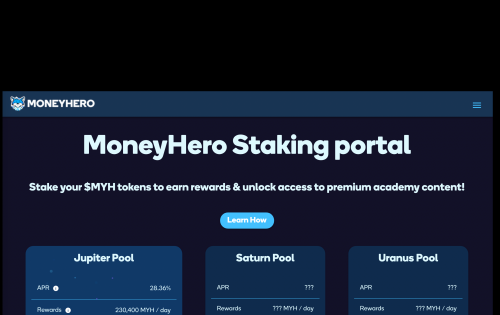

# MoneyHero

MoneyHero 于 2017 年在德国成立，当时名为“Geldhelden”，旨在为所有人提供金融教育。最初的社区现在有超过 7000 名成员。2021 年，该组织决定在 Tezos 上建立一个区块链项目，并于同年 6 月推出了自己的代币 $MYH。 

通过在 MoneyHero 质押门户上质押 $MYH 代币，用户现在只需将内容锁定一段时间即可访问他们之前必须支付的信息。至少 99.99 美元的押金可访问高级课程和其他材料。除了这种独特的质押模式之外，参与者还将像其他质押优惠一样获得代币形式的定期奖励！

许多州在社会援助，失业援助，再培训，重新社会化等领域的支出很高。通过这些计划，他们利用纳税人的钱来帮助那些已经落入社会安全网且无法支持自己的人。孔子说：“授人以鱼，养人一日；授人以渔，养人终生。”我们的使命是首先向受过金融教育的人们展示如何避免跌入社会安全网。

这一切都始于多特蒙德房地产投资者的定期聚会。我们学到了很多东西，以至于我们成立了现金流俱乐部和 MoneyHeros 组织。

我们现在在社交媒体上拥有超过 100 万的影响力，我们文章的数十万读者，以及 MoneyHeroes 社区应用程序上的数千名成员。

借助 MoneyHero 代币，社区呈指数级增长，我们越来越接近我们的目标：将金融教育融入社会的广度。

